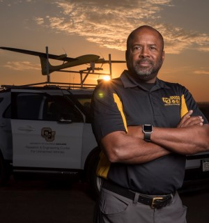

# Dr. Brian Argrow (he/him)

<i class="fab fa-github"></i>
<i class="fab fa-twitter"></i>

## Schaden Leadership Endowed Professor & Dept. Chair Ann and H.J. Smead Dept. of Aerospace Engineering Sciences, [University of Colorado](https://www.colorado.edu/aerospace/brian-argrow)

## Research Interests:
Dr. Argrow is the Schaden Leadership Professor and Chair of the Ann and H.J. Smead Department of Aerospace Engineering Sciences at the University of Colorado Boulder; Director of the Integrated Remote & In Situ Sensing Program; and Founding Director (Emeritus) of the Research & Engineering Center for Unmanned Vehicles. His areas of research include the design and deployment of unmanned aircraft systems (UAS) with emphasis on atmospheric sensing systems. 

## Role in Investigation:
Student collaboration lead.  Integrated Remote & In-Situ Sensing Program (IRISS) provides research opportunities for graduate and undergraduate students; Summer Multicultural Access to Research Training (SMART) program.

## Experience Related to the Investigation:
In 2010, he led the first UAS team to collect thermodynamic data in a tornadic supercell thunderstorm during the second Verification of the Origin of Rotation in Tornadoes Experiment (VORTEX-2). In 2020, his UAS team collected thermodynamic, wind, and turbulence measurements for the NOAA Atlantic Tradewind Ocean-Atmosphere Mesoscale Interaction Campaign (ATOMIC) in the tropical North Atlantic east of Barbados. His UAS teams have also made multiple deployments to Oliktok Point, AK to collect sea, air, and cloud measurements. He is principle investigator of an AFOSR Multidisciplinary University Research Initiative (MURI) that is using balloon-borne payloads to routinely measure turbulence and particulate distributions in the middle stratosphere. He currently serves on the Aeronautics and Space Engineering Board of the National Academies of Science, Engineering, and Medicine, and has served on the USAF Scientific Advisory Board, as well as several NASA and NOAA advisory boards.

## Experience:
- 2019 - Present, Schaden Leadership Chair, University of Colorado
- 2017 - Present, Chair, Aerospace Engineering Sciences, University of Colorado
- 2014 - Present, Director, Integrated Remote and In Situ Sensing, University of Colorado
- 2006 - Present, Professor, Aerospace Engineering Sciences, University of Colorado
- 2004 - 2012, Director, Research and Engineering Center for Unmanned Vehicles, University of Colorado
- 2002 - 2004, Associate Chair, Aerospace Engineering Sciences, University of Colorado
- 1999 - 2005, Associate Professor, Aerospace Engineering Sciences, University of Colorado
- 1992 - 1999, Assistant Professor, Aerospace Engineering Sciences, University of Colorado
- 1989 - 1992, Assistant Professor, School of Aerospace and Mechanical Engineering, University of Oklahoma
- 1986 - 1988, Instructor, School of Aerospace and Mechanical Engineering, University of Oklahoma

## Education:
- 1986 - 1989: Ph.D., Aerospace Engineering, University of Oklahoma
- 1983 - 1986: M.S., Mechanical Engineering, University of Oklahoma
- 1979 - 1983: B.S., Aerospace Engineering, University of Oklahoma

## Honors, Awards, and Activities
- 2016:	 American Institute of Aeronautics and Astronautics (AIAA) Fellow
- 2014:	 Center for STEM Learning Fellow
- 2011-12:   University of Colorado Boulder Faculty Assembly Excellence in Service Award
- 2009: 	Department of the Air Force Exemplary Civilian Service Award
- 2007 UCB Gold Best Should Teach Award
- 2003 Marinus Smith Award
- 2000 President's Teaching Scholar
- 1996-1997 BFA Award for Excellence in Teaching 
- 1996 The Charles A. Hutchinson Memorial Teaching Award
- 1995 Engineering Teaching Excellence Award, W.M. Keck Foundation

## Mentoring Experience
Dr. Argrow has supervised five post-doctoral researchers, 14 doctoral candidates, and seven M.S. students.  He has taught graduate- and undergraduate-level courses at the University of Colorado since 1997, and has been the recipient of numerous teaching awards and recognitions.

## Science Teams, Working Groups, and Organizing Committees
- Session Chair, Autonomous UAS Operations in High-Density Low-Altitude Urban Environments, AIAA Science and Technology Forum (SciTech), San Diego (Jan 7-11 2019).
- Chair, 3rd AUVSI-AIAA Workshop on Civilian Applications of Unmanned Aircraft Systems, AUVSIXPONENTIAL, Dallas, TX (May 2017).
- Organizing Committee and presenter for the NCAR-EOL Community Workshop on Unmanned Aircraft Systems for Atmospheric Research, 21-24 Feb 2017.
- Panel Organizer-Moderator, Integrated Remote & In Situ Sensing (IRISS) Initiative, CU’s “Our Space. Our Future.” Grand Challenges Event, Denver Museum of Nature and Science, Denver, CO (Sep 2015)
- Panel Organizer-Moderator, Small UAS in the Academic Setting, NASA UAS Traffic Management (UTM) Convention, NASA Ames Research Center, Moffett Field, CA (July 2015)
- Panel Organizer-Moderator, UAS Policy Issues, International Society for Atmospheric Research Using Remotely Piloted Aircraft (ISARRA), University of Oklahoma, Norman, K, 2015 (May 2015)
- ISARRA 2015 Organizing Committee (May 2015)
- Chair and Panel Moderator, AUVSI-AIAA Second Workshop on Civilian Applications of Unmanned Aircraft Systems, Orlando, FL (May 2014)
- AUVSI Unmanned Systems 2014 Technical Committee (May 2014)
- Executive Steering Committee, AIAA AVIATION 2013 Conf., Los Angeles, CA (Aug 2013)
- Panel Organizer, Creating an Developing the Market for UAS, AIAA AVIATION 2013 Conf., Los Angeles, CA (Aug 2013)
- Technical Events Chair, 2012 AIAA Infotech at Aerospace Conf., St. Louis, Missouri (Jun 2012)
- Technical Events Chair, 2011 AIAA Infotech at Aerospace Conf., St. Louis, Missouri (Mar 2011)
- Moderator, Unmanned Air Systems: The Next Generations,” 48th AIAA Aerospace Sciences Meeting New Horizons Forum, Orlando, FL, Jan 2010.
- Chair IDGA UAV Workshop, Vienna, VA., (Apr 2010)
- Co-Chair, AUVSI-FAA Workshop on Best Practices for UAS Integration into the National Air Space, AUVSI North America Conference, Washington, D.C. (Aug 2009)
- Co-Chair, UAS Research Directions for the National Airspace System, Unmanned Unlimited Conference and Exhibit, Seattle, WA (Apr 2009)
- Co-Chair, NSF-AUVSI-FAA-DHS Workshop on UAS Research Directions for the National Air Space, AUVSI North America Conference, San Diego, CA (Jun 2008)
- Conference Co-Chair, Civilian Applications of Unmanned Aircraft Systems, Boulder, CO (Oct 2007)
- Technical Program Committee Infotech at Aerospace Conference, Washington, DC (2005)
- Technical Program Committee, Unmanned Unlimited Conference, Workshop, and Exhibit, Chicago (2004)
- Technical Program Co-Chair, 2nd Unmanned Unlimited Conference Systems Technologies, and Operations Aerospace, Land, and Sea Conference, Workshop, and Exhibit, San Diego (2003)
- Technical Program Co-Chair, 1st Unmanned Aerospace Vehicles, Systems, Technologies, and Operations Conference and Workshop, Portsmouth, VA (2002)

